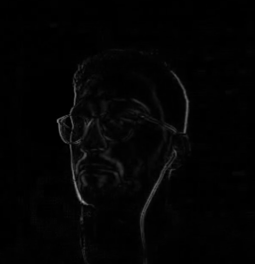

.. Virtual Mirror documentation master file, created by
   sphinx-quickstart on Fri Jun  4 13:56:16 2021.
   You can adapt this file completely to your liking, but it should at least
   contain the root `toctree` directive.

Virtual Mirror's Documentation
==========================================

.. important::
   This documentation was generated on |today|, and is rebuilt with every ``master`` release.

.. toctree::
   :maxdepth: 2
   :caption: Contents:

   
Common Coloring Methods
=======================
.. automodule:: src.cv.makeup.commons
   :members:

Constants
=======================
This scripts holds the constant point indexes for each of the face components.

.. automodule:: src.cv.makeup.constants
   :members:

Utils
=========
This script includes:
   - defenitions of functions for executing makeup workers in parallel to increase speed
   - functions to be called by the REST API, for enabling and disabling webcam, makeups and generating desired image.

.. automodule:: src.cv.makeup.utils
   :members:

Appendix
==========

   This picture shows the result of absolute differences calculated for a frame in motion detecion part of :py:meth:`apply_makeup`.
   
Indices and tables
==================

* :ref:`genindex`
* :ref:`modindex`
* :ref:`search`
